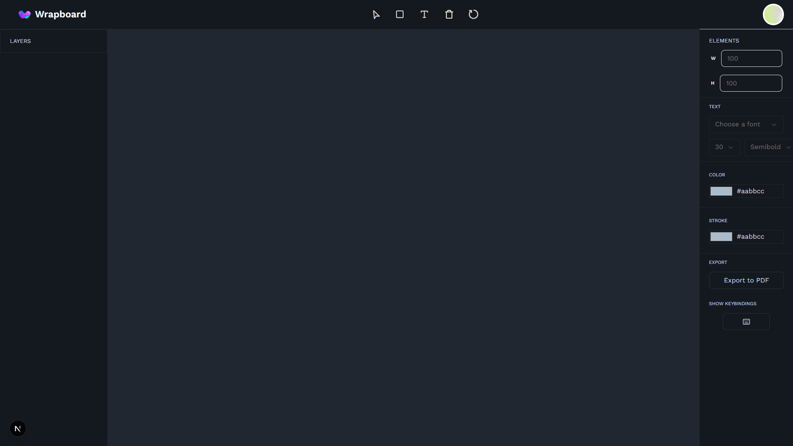
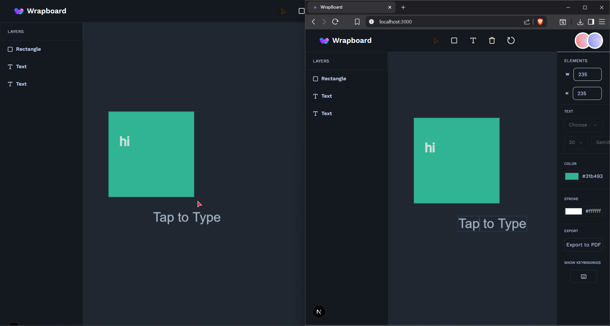
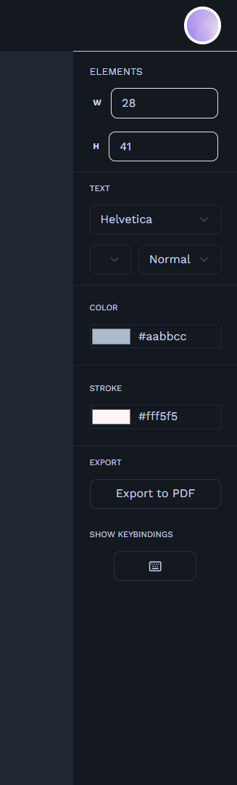
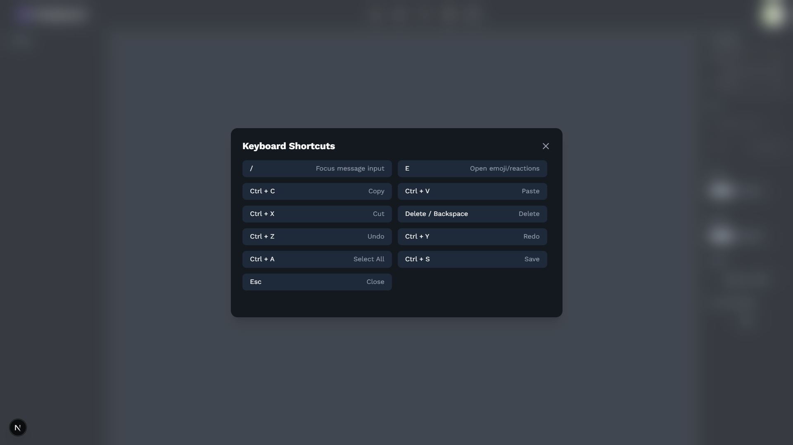
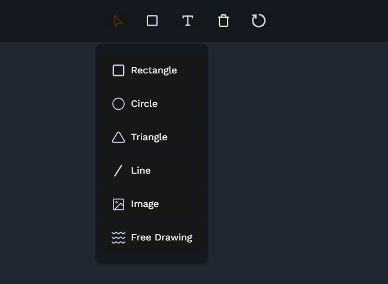

# Wrapboard

**Wrapboard** is a real-time collaborative design board built with Next.js, React, and Liveblocks. It lets users draw on a shared canvas, customize elements, and export their work as a PDF. Ideal for brainstorming sessions, wireframing, or planning UI/UX layouts with teammates.

---

## ✨ Features

- 🎨 Interactive canvas (powered by Fabric.js)
- 🔧 Customization panel to style shapes, text, and more
- 📤 Export canvas to PDF using jsPDF
- 🤝 Real-time collaboration via Liveblocks
- ⌨️ Keyboard shortcuts to boost workflow
- ⚙️ Modern, responsive UI built with Tailwind and Radix UI

---

## 📸 Screenshots

| Home | Collaboration | Customization |
|------|---------------|----------------|
|  |  |  |

| Key Bindings | Toolbar |
|--------------|---------|
|  |  |

---

## 🛠 Tech Stack

- **Framework**: [Next.js](https://nextjs.org/)
- **Canvas Engine**: [Fabric.js](http://fabricjs.com/)
- **Collaboration**: [Liveblocks](https://liveblocks.io/)
- **PDF Export**: [jsPDF](https://github.com/parallax/jsPDF)
- **UI**: Tailwind CSS + ShadCn UI
- **Icons**: Lucide React

---

## 📦 Dependencies

```json
"dependencies": {
  "@liveblocks/client": "^2.24.3",
  "@liveblocks/react": "^2.24.3",
  "@liveblocks/react-ui": "^2.24.3",
  "@radix-ui/react-dropdown-menu": "^2.1.15",
  "@radix-ui/react-label": "^2.1.7",
  "@radix-ui/react-select": "^2.2.5",
  "@radix-ui/react-slot": "^1.2.3",
  "class-variance-authority": "^0.7.1",
  "clsx": "^2.1.1",
  "fabric": "^5.5.2",
  "jspdf": "^3.0.1",
  "lucide-react": "^0.513.0",
  "next": "15.3.3",
  "postcss": "^8.5.4",
  "react": "^19.0.0",
  "react-dom": "^19.0.0",
  "tailwind-merge": "^3.3.0",
  "uuid": "^11.1.0"
}
```
---
## Local Development
1. Clone the repo
```
git clone https://github.com/baseer4/wrapboard.git
cd wrapboard
```
2. Install dependencies
```
npm install
# or
yarn install
```
3. Start the dev server
```
npm run dev
# or
yarn dev
```
---
## Environment Setup (Liveblocks)
You need a Liveblocks project to enable real-time collaboration.

1. Create an account at Liveblocks.io

2. Create a project and get your Public API Key

3. Add a .env.local file in the root of your project:

```
NEXT_PUBLIC_LIVEBLOCKS_PUBLIC_KEY=your_public_key_here
```
---

## 📝 License
This project is licensed under the MIT License.


